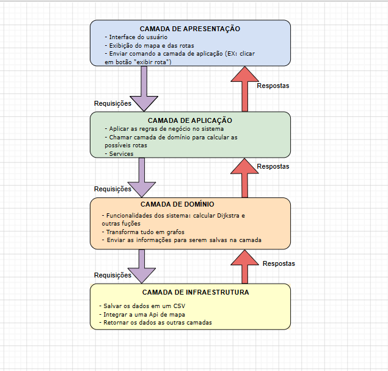

# E2 — Design Técnico, Arquitetura e Backlog

> **Disciplina:** Teoria dos Grafos  
> **Prazo:** 13 de abril de 2026  
> **Peso:** 20% da nota final  

---

## Identificação do Grupo

| Campo | Preenchimento |
|-------|---------------|
| Nome do projeto | Logística de Entregas|
| Repositório GitHub | https://github.com/ProjetoTeoriadosGrafos973/Logistica-de-Entrega |
| Integrante 1 | Maria Beatriz Santos Carvalho — 38778131 |
| Integrante 2 | Gabrielle dos Santos Carmo — 44124937 |
| Integrante 3 | Gabriel Santos da Silva — 42565561 |


---

## 1. Algoritmos Escolhidos

- Algoritmo de Dijkstra
### 1.1 Algoritmo Principal

| Campo | Resposta |
|-------|----------|
| Nome do algoritmo | Algoritmo de Dijkstra |
| Categoria | Algoritmo Guloso|
| Complexidade de tempo |  O((V + E) log V), utilizando fila de prioridade (min-heap)|
| Complexidade de espaço | O(V + E), considerando a lista de adjacência e estruturas auxiliares|
| Problema que resolve | Calcula a melhor rota entre o centro de distribuição e os clientes|

**Por que este algoritmo foi escolhido?**

<!-- Justifique a escolha para o seu domínio específico -->
Optamos pelo uso do algoritmo de Dijkstra porque ele se adapta melhor ao contexto do nosso projeto de logística. Como estamos lidando com rotas de entrega, onde cada caminho possui um peso associado (como distância em quilômetros e condições de trânsito), precisamos de um algoritmo que encontre o menor custo total entre os pontos. 
No nosso caso, os pesos das arestas são sempre positivos (por exemplo, distância × fator de trânsito), o que torna o Dijkstra uma escolha adequada e eficiente para calcular a melhor rota entre o centro de distribuição e os clientes

**Alternativa descartada e motivo:**

| Algoritmo alternativo | Motivo da exclusão |
|----------------------|-------------------|
| Busca em Largura (BFS – Breadth-First Search) | A BFS foi considerada inicialmente por ser simples e eficiente em grafos não ponderados. No entanto, ela não leva em conta o peso das arestas, tratando todos os caminhos como se tivessem o mesmo custo. Na prática, isso não funciona para o nosso problema. Por exemplo, uma rota com mais ruas pode ser mais rápida ou mais curta dependendo do trânsito ou da distância total. Nesse cenário, a BFS poderia escolher um caminho com menos “saltos”, mas que não é o mais eficiente em termos reais. |

**Limitações no contexto do problema:**

<!-- Liste ao menos 1 limitação relevante -->
O algoritmo de Dijkstra não funciona corretamente com pesos negativos, o que não é um problema no nosso caso. Além disso, seu desempenho pode cair em grafos muito densos caso não seja utilizada uma estrutura de dados eficiente, como a fila de prioridade.

**Referência bibliográfica:**

> <!-- Formato ABNT ou IEEE. Ex.: CORMEN, T. H. et al. Algoritmos: teoria e prática. 3. ed. Rio de Janeiro: Elsevier, 2012. -->
CORMEN, T. H. et al. Algoritmos: teoria e prática. 3. ed. Rio de Janeiro: Elsevier, 2012.

---


## 2. Arquitetura em Camadas

> Insira o diagrama abaixo. Pode ser exportado do Draw.io, Excalidraw, etc.



### Descrição das camadas

| Camada | Responsabilidade | Artefatos principais |
|--------|-----------------|----------------------|
| Apresentação (UI/CLI) | Interface do usuário | Exibir mapas e rotas, enviar comandos a camada de aplicação|
| Aplicação (Service) | Regras de negócio |  Chamar camada de domínio para calcular as possíveis rotas, estruturar o service da aplicação|
| Domínio (Core) |Funcionalidades do sistema | Calcular os algoritmos e outras funções do sistema, transformar tudo em grafo, enviar as informações para serem salvas na camada de infraestrutura|
| Infraestrutura (I/O) | Salvar dados | Salvar os dados em um arquivo CSV, integrar a uma API de mapa, retornar os dados as outras camadas|

---

## 3. Estrutura de Diretórios

```
nome-do-projeto/
├── docs/
│   ├── README.md
│   └── arquitetura_e2.png
│   └── E1_template.md
│   └── E2_template.md
├── src/
│   ├── core/
│   │   ├── graph.py         
│   │   └── edge.py
│   ├── algorithms/
│   │   └── algoritmo.py      
│   ├── io/
│   │   └── file_reader.py
│   └── main.py
├── tests/
│   ├── test_graph.py
│   └── test_algorithms.py
├── data/
└── requirements.txt        
```

> **Justificativa de desvios** *(se houver)*: 
Foi adicionada apenas o arquivo png contendo a imagem da arquitetura em camadas.
---

## 4. Definição do Dataset

**Formato de entrada aceito:**

<!-- JSON / CSV / GraphML / lista de adjacência — descreva a estrutura -->
CSV

**Exemplo de estrutura do arquivo de entrada:**

```csv
#vertices=6
origem,destino,peso
0,4,8
0,3,6
1,5,7
1,2,1
3,4,6
```

**Estratégia de geração aleatória:**

| Parâmetro | Descrição |
|-----------|-----------|
| Número de vértices | configurável via argumento |
| Densidade | configurável (0.0 a 1.0) |
| Faixa de pesos | Entre 1 e 10|

---

## 5. Backlog do Projeto

### 5.1 In-Scope — O que será implementado

| # | Funcionalidade | Prioridade | Critério de aceite |
|---|---------------|------------|-------------------|
| 1 |Cadastro de pontos de entrega | Alta| Dado um usuário autenticado, quando ele cadastrar um novo ponto de entrega, então o sistema deve adicionar esse ponto como um vértice no grafo.|
| 2 | Cadastro de rotas entre pontos | Média | Dado dois pontos cadastrados, quando o usuário criar uma rota entre eles, então o sistema deve registrar uma aresta dirigida com peso (tempo, distância ou custo). |
| 3 | Cálculo da menor rota |Alta |  Dado um ponto de origem e destino, quando o usuário solicitar o cálculo de rota, então o sistema deve retornar o menor caminho utilizando o algoritmo de Dijkstra.|
| 4 | Integração com mapas reais | Baixa | Dado uma rota existente, quando o usuário inserir o ponto de partida e o ponto de chegada, então o sistema deve mostrar a interface do mapa ao usuário. |
| 5 | Visualização do grafo | Alta | Dado os pontos e rotas cadastrados, quando o usuário acessar o sistema, então o sistema deve exibir o grafo de forma visual com seus vértices e arestas. |

### 5.2 Out-of-Scope — O que NÃO será feito

| Funcionalidade excluída | Motivo |
|------------------------|--------|
| Rastreamento em tempo real de veículos | Não será implementado por exigir infraestrutura de dados em tempo real.|
| Previsão inteligente de trânsito (IA)| Não será implementado por fugir do foco da disciplina.|
| Atualização de condições das rotas | Não será implementado por utilizar mais recursos e mais tempo da disciplina.  |

---

## Checklist de Entrega

- [X] Big-O de tempo e espaço declarados para cada algoritmo
- [X] Ao menos 1 alternativa descartada com justificativa
- [X] Diagrama de arquitetura com 4 camadas identificadas
- [X] Referência bibliográfica para cada algoritmo (ABNT ou IEEE)
- [X] Backlog com ≥ 5 itens In-Scope e ≥ 3 Out-of-Scope
- [X] Ao menos 3 critérios de aceite no formato "dado / quando / então"
- [X] Exemplo de estrutura de arquivo de entrada presente

---

*Teoria dos Grafos — Profa. Dra. Andréa Ono Sakai*
