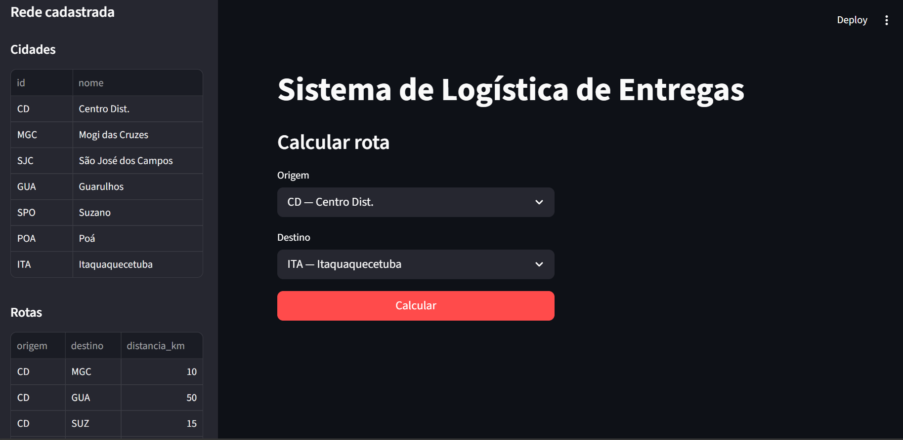

# E3 — MVP: Núcleo Funcional com Primeiras Telas

> **Disciplina:** Teoria dos Grafos  
> **Prazo:** 10 de maio de 2026  
> **Peso:** 25% da nota final  

---

## Identificação do Grupo

| Campo | Preenchimento |
|-------|---------------|
| Nome do projeto | |
| Repositório GitHub | |
| Integrante 1 | Gabriel Santos da Silva - 42565561  |
| Integrante 2 | Gabrielle dos Santos Carmo  - 44124937 |
| Integrante 3  | Maria Beatriz Santos Carvalho - 38778131|

---

## 1. Como Executar o MVP

> Instrua como rodar o projeto do zero. Alguém que nunca viu o código deve conseguir executar seguindo estas instruções.

**Pré-requisitos:**

```bash
    Python 3.13
```

**Instalação:**

```bash
# Clone e instale dependências
git clone https://github.com/ProjetoTeoriadosGrafos973/Logistica-de-Entrega.git
cd Logística-de-Entrega
pip install -r requirements.txt 
```

**Execução:**

```bash
# Comando para rodar o MVP
 python -m streamlit run src/main.py
```

**Saída esperada:**

```
#1 | Centro Dist. → Mogi das Cruzes → São José dos Campos | 95 km
#2 | Centro Dist. → Guarulhos | 50 km
#3 | Mogi das Cruzes → SPC | 60 km
```

---

## 2. Algoritmo Implementado

| Campo | Resposta |
|-------|----------|
| Nome do algoritmo | Dijkstra |
| Arquivo de implementação | src/algorithms/algoritmoDijkstra.py |
| Complexidade de tempo |  O((V + E) log V). |
| Complexidade de espaço | O(V + E) |

**Trecho do código com comentário de Big-O:**

```python
# Cole aqui o trecho principal do algoritmo
# com comentários de complexidade nas linhas críticas
```

---

## 3. Estrutura do Repositório

> Confirme que a estrutura implementada está de acordo com o E2.

```
Logistica-de-Entrega/
├── docs/
│   ├── README.md
│   └── arquitetura_e2.png
│   └── E1_template.md
│   └── E2_template.md
│   └── E3_template.md
├── src/
│   ├── core/
│   │   ├── graph.py         
│   │   └── edge.py
│   ├── algorithms/
│   │   └── algoritmo.py      
│   ├── ios/
│   │   └── file_reader.py
│   └── main.py
├── tests/
│   ├── test_graph.py
│   └── test_algorithms.py
├── data/
│   ├── cidades.csv
│   ├── rotas.csv
│   └── entregas.csv
└── requirements.txt        
```

**Desvios em relação ao E2** *(se houver)*:

---

## 4. Telas do MVP

> Insira screenshots ou gravações da interface funcionando.

### Tela de Entrada



*Descrição:*

### Tela de Resultado


*Descrição:*

---

## 5. Testes Unitários

| Algoritmo | Caso de teste | Status | Comando para executar |
|-----------|--------------|--------|----------------------|
| | Caso base | ✅ / ✅ | `pytest tests/test_algoritmo.py:tests\test_algorithms.py ..      ` |
| | Grafo vazio | ✅ / ❌ | | 
| | Grafo completo | ✅ / ✅ | | `pytest tests/test_algoritmo.py:tests\test_graph.py ..       ` 

**Como rodar todos os testes:**

```bash
python -m pytest tests/test_algorithms.py
python -m pytest tests/test_graph.py
```

**Resultado atual:**

```
# Cole aqui a saída do pytest / JUnit
```

---

## 6. Histórico de Commits

> Liste os 5+ commits mais relevantes desta entrega.

| Hash (7 chars) | Mensagem | Autor |
|----------------|----------|-------|
| `abc1234` | feat: implementa classe Graph com lista de adjacência | |
| `def5678` | feat: implementa algoritmo Dijkstra | |
| `ghi9012` | test: adiciona testes unitários para Dijkstra | |
| `jkl3456` | feat: leitura de grafo a partir de JSON | |
| `mno7890` | feat: tela de resultado via CLI | |

---

## 7. O que está funcionando / O que ainda falta

| Funcionalidade | Status | Observação |
|---------------|--------|------------|
| Classe do grafo | ✅ Completo | |
| Algoritmo principal | ✅ Completo | |
| Leitura de arquivo | ✅ Completo | |
| Tela de entrada | ✅ Completo | |
| Tela de resultado | ✅ Completo | |
| Testes unitários |  🔄 Parcial | |

---

## Checklist de Entrega

- [X] Repositório público e acessível
- [X] .gitignore configurado
- [X] README com instruções de execução do MVP
- [X] Algoritmo principal executando sem erros
- [X] Tela de entrada e tela de resultado demonstráveis
- [X] 3 testes unitários por algoritmo (mínimo caso base passando)
- [X] ≥ 5 commits com prefixos semânticos (feat:, fix:, test:, docs:)
- [X] Ao menos 1 arquivo de grafo de exemplo em `data/`

---

*Teoria dos Grafos — Profa. Dra. Andréa Ono Sakai*
