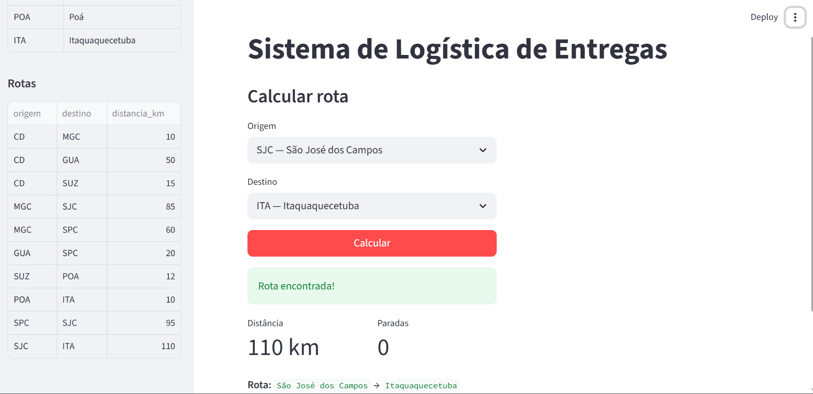

# E3 — MVP: Núcleo Funcional com Primeiras Telas

> **Disciplina:** Teoria dos Grafos  
> **Prazo:** 10 de maio de 2026  
> **Peso:** 25% da nota final  

---

## Identificação do Grupo

| Campo | Preenchimento |
|-------|---------------|
| Nome do projeto | Logística de Entregas|
| Repositório GitHub | https://github.com/ProjetoTeoriadosGrafos973/Logistica-de-Entrega |
| Integrante 1 | Gabriel Santos da Silva - 42565561  |
| Integrante 2 | Gabrielle dos Santos Carmo  - 44124937 |
| Integrante 3  | Maria Beatriz Santos Carvalho - 38778131|

---

## 1. Como Executar o MVP

> Instrua como rodar o projeto do zero. Alguém que nunca viu o código deve conseguir executar seguindo estas instruções.

**Pré-requisitos:**

```bash
    Python 3.13
```

**Instalação:**

```bash
# Clone e instale dependências
git clone https://github.com/ProjetoTeoriadosGrafos973/Logistica-de-Entrega.git
cd Logística-de-Entrega
pip install -r requirements.txt 
```

**Execução:**

```bash
# Comando para rodar o MVP
 python -m streamlit run src/main.py
```

**Saída esperada:**

```
#1 | Centro Dist. → Mogi das Cruzes → São José dos Campos | 95 km
#2 | Centro Dist. → Guarulhos | 50 km
#3 | Mogi das Cruzes → SPC | 60 km
```

---

## 2. Algoritmo Implementado

| Campo | Resposta |
|-------|----------|
| Nome do algoritmo | Dijkstra |
| Arquivo de implementação | src/algorithms/algoritmoDijkstra.py |
| Complexidade de tempo |  O((V + E) log V). |
| Complexidade de espaço | O(V + E) |

**Trecho do código com comentário de Big-O:**

```python

def dijkstra(grafo: Grafo, origem: str):
    # O(V)
    distancias = {no: float('inf') for no in grafo.nos()}
    anteriores = {no: None for no in grafo.nos()}
    distancias[origem] = 0
    
    # O(1)
    # Heap para escolher o nó mais próximo
    heap = [(0, origem)]

    # Enquanto houver nós, ele executa a heap
    while heap:
        distancia_atual, no_atual = heapq.heappop(heap)
        if distancia_atual > distancias[no_atual]:
            continue

        # Percorre todos os vizinhos do nó atual
        for aresta in grafo.adjacencia[no_atual]:
            nova_dist = distancias[no_atual] + aresta.peso
            if nova_dist < distancias[aresta.destino]:
                distancias[aresta.destino] = nova_dist
                anteriores[aresta.destino] = no_atual

                # Insere as novas distâncias no heap
                heapq.heappush(heap, (nova_dist, aresta.destino))

    return distancias, anteriores

def reconstruir_caminho(anteriores, origem, destino):
    caminho, no = [], destino
    # Percorre o destino até a origem
    while no:
        # O(1)
        caminho.append(no)
        # O(1)
        no = anteriores[no]
    # O(V)
    caminho.reverse()
    return caminho if caminho and caminho[0] == origem else []
```

---

## 3. Estrutura do Repositório

> Confirme que a estrutura implementada está de acordo com o E2.

```
Logistica-de-Entrega/
├── docs/
│   ├── README.md
│   └── arquitetura_e2.png
│   └── E1_template.md
│   └── E2_template.md
│   └── E3_template.md
|   └── assets
├── src/
│   ├── core/
│   │   ├── graph.py         
│   │   └── edge.py
│   ├── algorithms/
│   │   └── algoritmo.py      
│   ├── ios/
│   │   └── file_reader.py
│   └── main.py
├── tests/
│   ├── test_graph.py
│   └── test_algorithms.py
├── data/
│   ├── cidades.csv
│   ├── rotas.csv
│   └── entregas.csv
└── requirements.txt        
```

**Desvios em relação ao E2** *(se houver)*:
 
 Apenas a pastas Assets

---

## 4. Telas do MVP

> Insira screenshots ou gravações da interface funcionando.

### Tela de Entrada


*Descrição:*
A tela de entrada mostra  um menu lateral com informações sobre os centros de distribuição e os pontos de entregas, além das rotas.

### Tela de Resultado



*Descrição:*
A tela de saída mostra uma rota já calculada pelo algoritmo, indicando a quilometragem e as paradas necessárias.

---

## 5. Testes Unitários

| Algoritmo | Caso de teste | Status   | Comando para executar |
|-----------|-------------- |--------  |---------------------- |
| Dijkstra  | Caso base     | ✅ / ✅ | `pytest tests/test_algoritmo.py:tests\test_algorithms.py ..      ` |
| Grafo     | Grafo vazio   | ✅ / ✅ | `pytest tests/test_graph.py:tests\test_graph.py ..      `  | 
| Grafo     | Grafo completo| ✅ / ✅ | `pytest tests/test_graph.py:tests\test_graph.py ..       ` |

**Como rodar todos os testes:**

```bash
python -m pytest tests/test_algorithms.py
python -m pytest tests/test_graph.py
```

**Resultado atual:**

```
tests\test_algorithms.py ..Caminho: ['A', 'B', 'C']

tests\test_graph.py .Arestas: True
```

---

## 6. Histórico de Commits

> Liste os 5+ commits mais relevantes desta entrega.

| Hash (7 chars) | Mensagem | Autor |
|----------------|----------|-------|
| `ef7dd34fd454d1ee239600f2cd1a73ab979ce995` | docs: Ajustar documento 'E3_MVP_LOGISTICA_DE_ENTREGAS' | GRUPO |
| `8d3a2283f93ae7c2a97a18f3fc8d8b81409fd3dd` | feat: Ajustar Documento E3 | GABRIELLE|
| `c364a9c6828eecfcbf7a67bc63047d9b01cf0df5` | feat: ajuste interface | GABRIEL |
| `90f9fac6befbdab3861d83e4b9da86daf3cc557e` | feat: construindo interface visual | MARIA|
| `99cf68a998e4b18c9e21ffb33b05ba691f23b708` | feat: Adicionar novas funcionalidades | GRUPO|

---

## 7. O que está funcionando / O que ainda falta

| Funcionalidade | Status | Observação |
|---------------|--------|------------|
| Classe do grafo | ✅ Completo | A classe dos grafos funciona como o esperado |
| Algoritmo principal | ✅ Completo | O algoritmo Dijkstra  funciona como esperado |
| Leitura de arquivo | ✅ Completo | O arquivo file_reader consegue lê e identificar todos os arquivos em formato csv |
| Tela de entrada | ✅ Completo | A tela de saída mostra a interface do sistema como esperado |
| Tela de resultado | ✅ Completo | A tela de resultado mostra a interface do sistema como esperado |
| Testes unitários |  🔄 Parcial | Os testes funciona por um comando em um computador, mas em outros funciona de outra forma |

---

## Checklist de Entrega

- [X] Repositório público e acessível
- [X] .gitignore configurado
- [X] README com instruções de execução do MVP
- [X] Algoritmo principal executando sem erros
- [X] Tela de entrada e tela de resultado demonstráveis
- [X] 3 testes unitários por algoritmo (mínimo caso base passando)
- [X] ≥ 5 commits com prefixos semânticos (feat:, fix:, test:, docs:)
- [X] Ao menos 1 arquivo de grafo de exemplo em `data/`

---

*Teoria dos Grafos — Profa. Dra. Andréa Ono Sakai*
